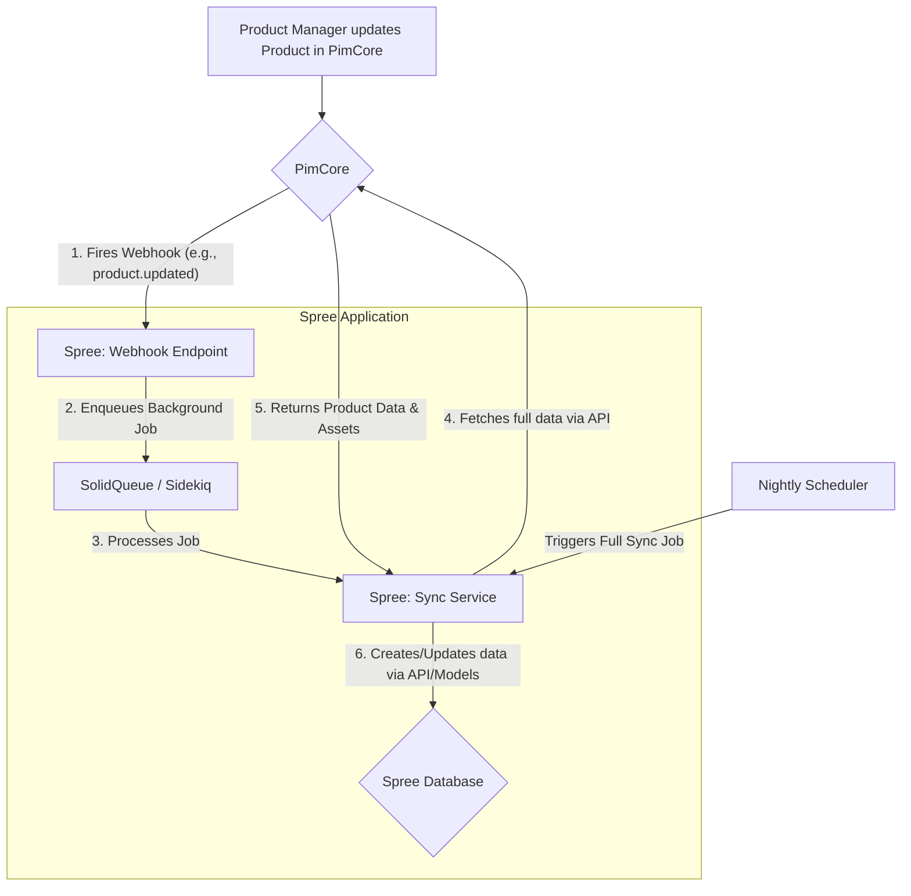

# Integrating PimCore with Spree Commerce

This document outlines a strategy for integrating PimCore as a Product Information Management (PIM) and Digital Asset Management (DAM) system with a Spree Commerce storefront.

## 1. High-Level Strategy

The core principle of this integration is to establish **PimCore as the Single Source of Truth (SSOT)** for all product marketing and descriptive data, including descriptions, specifications, images, and videos. Spree Commerce will consume this data to populate the storefront but will remain the system of record for e-commerce transactional data like pricing, stock, and orders.

The integration will be API-driven, utilizing PimCore's REST API for data retrieval and Spree's Platform API for data ingestion.

### Key Components:
*   **PimCore:** Manages product data models, content, and digital assets.
*   **Spree Commerce:** Manages the e-commerce experience, pricing, inventory, and checkout.
*   **Integration Layer:** A set of services and jobs within the Spree application responsible for synchronizing data between the two systems.

## 2. Data Model & Responsibilities

It's crucial to define which system owns which piece of data.

| Data | System of Record | Notes |
| :--- | :--- | :--- |
| **Product Information** | | |
| SKU, Name, Description | PimCore | Master product information. |
| Product Properties/Attributes | PimCore | E.g., color, size, material, technical specs. |
| Categories/Taxonomy | PimCore | Product classification. |
| SEO data (meta title, etc.) | PimCore | Marketing-driven content. |
| **Digital Assets** | | |
| Images | PimCore | Master product imagery. |
| Videos & Documents | PimCore | Rich content assets. |
| **E-commerce Data** | | |
| Price | Spree | Can be in PimCore, but often managed in Spree for different currencies, sales, etc. |
| Stock / Inventory | Spree | Managed by Spree's stock locations and stock items. Highly transactional. |
| Shipping & Tax Categories | Spree | E-commerce-specific logic. |
| Promotions & Discounts | Spree | Managed by Spree's promotion engine. |
| Orders, Customers, Carts | Spree | Core e-commerce transactional data. |

## 3. Synchronization Mechanism

A hybrid approach of webhooks for real-time updates and scheduled jobs for data consistency is recommended.

### Data Flow Diagram



### 3.1. Real-Time Sync (Webhooks)

*   **PimCore Configuration:** Configure webhooks in PimCore to fire on events like `asset.update`, `object.update` for your product data objects.
*   **Spree Implementation:**
    1.  Create a dedicated, secure API endpoint in your Spree application to receive these webhooks.
    2.  Upon receiving a webhook, the endpoint should not process the data directly. Instead, it should enqueue a background job (e.g., `PimcoreSyncJob`) with the ID of the updated PimCore object.
    3.  The background job will then use a service (`PimcoreProductSyncService`) to fetch the complete data for that object from PimCore's API and update the corresponding record in Spree.

### 3.2. Batch Sync (Scheduled Jobs)

*   A recurring job (e.g., running nightly) should be implemented to ensure data consistency.
*   This job will query PimCore's API for all products modified since the last successful sync.
*   It will then iterate through the results and trigger the synchronization service for each product. This helps catch any missed webhook events and ensures new products are imported regularly.

## 4. Implementation Details

### 4.1. Extending Spree Models

You will need to add a field to `spree_products` and potentially other tables to store the unique identifier from PimCore.

**Create a migration:**
```bash
rails g migration AddPimcoreIdToSpreeProducts pimcore_id:string:index
```

```ruby
# db/migrate/xxxxxxxx_add_pimcore_id_to_spree_products.rb
class AddPimcoreIdToSpreeProducts < ActiveRecord::Migration[7.1]
  def change
    add_column :spree_products, :pimcore_id, :string
    add_index :spree_products, :pimcore_id, unique: true
  end
end
```
You might need similar fields for `spree_taxons` (categories) and `spree_assets` (images) if you want to sync them independently.

### 4.2. Synchronization Service Example

This service would be responsible for fetching data and updating Spree.

```ruby
# app/services/spree/pimcore_product_sync_service.rb
module Spree
  class PimcoreProductSyncService
    prepend ::Spree::ServiceModule::Base

    def call(pimcore_id:)
      # 1. Fetch data from PimCore API
      pimcore_data = Pimcore::Client.new.get_product(pimcore_id)
      return failure("Product not found in PimCore") unless pimcore_data

      # 2. Find or initialize Spree Product
      product = Spree::Product.find_or_initialize_by(pimcore_id: pimcore_id)

      # 3. Map attributes
      product.name = pimcore_data['name']
      product.description = pimcore_data['description']
      product.slug = pimcore_data['slug'] # Ensure slug is unique
      # ... map other attributes

      # Set default values for Spree-specific required fields if new
      if product.new_record?
        product.shipping_category ||= Spree::ShippingCategory.first
        product.price = 0 # Price managed in Spree
        product.available_on = Time.current
      end

      # 4. Save product
      return failure(product.errors.full_messages) unless product.save

      # 5. Sync Assets (Images)
      sync_assets(product, pimcore_data['assets'])

      success(product)
    end

    private

    def sync_assets(product, assets_data)
      # Logic to download images from PimCore DAM
      # and attach them to the Spree product using ActiveStorage.
      # Remember to avoid duplicating images on each sync.
      # You can store pimcore_asset_id on Spree::Image for mapping.
    end
  end
end
```
*Note: `Pimcore::Client` is a hypothetical client library you would write to interact with PimCore's API.*

### 4.3. Handling Rich Content (Videos, Articles)

Spree's default `Spree::Product` model doesn't have native support for videos or related articles. You have a few options:

*   **Embed in Description:** Embed video players (like YouTube/Vimeo) directly into the product description HTML, which is managed in PimCore.
*   **Use Metadata:** Spree models that include `Spree::Metadata` concern can store arbitrary key-value data. You could store video URLs or related article IDs in metafields.
*   **Custom Models:** For a more structured approach, create new models in Spree (e.g., `Spree::Video`, `Spree::Article`) and associate them with `Spree::Product`. The sync service would then populate these models.

## 5. Conclusion

Integrating PimCore with Spree creates a powerful enterprise-level e-commerce stack. By using PimCore as the PIM/DAM, you centralize product information management, enabling richer content and a consistent brand experience. The key to a successful integration is a well-defined data ownership model and a robust, API-driven synchronization mechanism.
